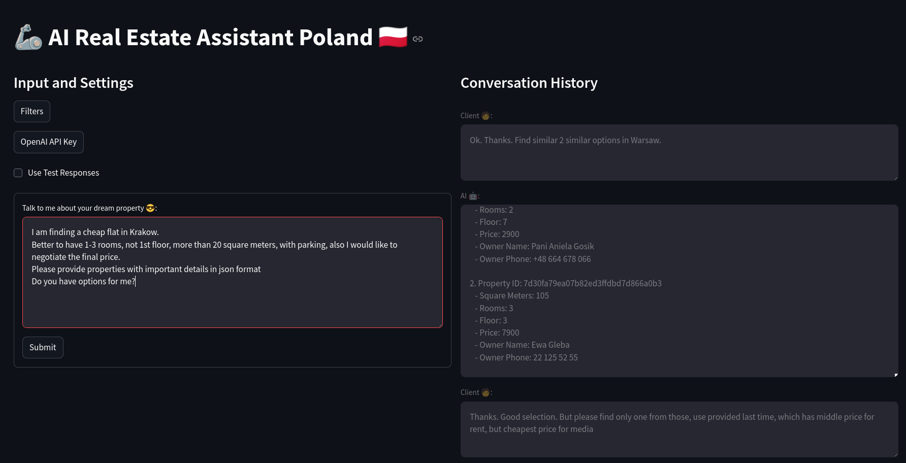

# [💬 AI Real Estate Assistant App](https://ai-real-estate-assistant.streamlit.app/)

## Requirements
Develop an AI-powered assistant for a real estate agency that assists potential buyers and renters in finding their ideal property.

The assistant should engage users in a conversation, asking questions about their preferences such as:
- location (city, neighborhood)
- budget range
- property type (apartment, house, condo)
- number of bedrooms and bathrooms
- desired amenities (parking, garden, pool)
- proximity to schools or public transportation.


## Description
POC app will have simple UI and will use local [real csv dataset for Poland](https://www.kaggle.com/datasets/krzysztofjamroz/apartment-prices-in-poland) (github hosted [apartments_rent_pl_2024_06.csv](dataset%2Fapartments_rent_pl_2024_06.csv)).

## Demo



[//]: # (![demo.gif]&#40;assets/demo.gif&#41;)


Formatted dataset will contain fake extra fields based on the task requirements, for demo purposes.
## DataFrame Columns

This table describes the columns in the DataFrame:

| Column Name              | Description                                |
|--------------------------|--------------------------------------------|
| `id`                     | Unique identifier for each record.         |
| `city`                   | Name of the city where the property is located. |
| `type`                   | Type of property (e.g., apartment, house). |
| `square_meters`          | Area of the property in square meters.     |
| `rooms`                  | Number of rooms in the property.           |
| `floor`                  | Floor number where the property is located. |
| `floor_count`            | Total number of floors in the building.    |
| `build_year`             | Year the building was constructed.         |
| `latitude`               | Latitude coordinate of the property.       |
| `longitude`              | Longitude coordinate of the property.      |
| `centre_distance`        | Distance from the property to the city center. |
| `poi_count`              | Number of Points of Interest nearby.       |
| `school_distance`        | Distance to the nearest school.            |
| `clinic_distance`        | Distance to the nearest clinic.            |
| `post_office_distance`   | Distance to the nearest post office.       |
| `kindergarten_distance`  | Distance to the nearest kindergarten.      |
| `restaurant_distance`    | Distance to the nearest restaurant.        |
| `college_distance`       | Distance to the nearest college.           |
| `pharmacy_distance`      | Distance to the nearest pharmacy.          |
| `ownership`              | Type of ownership (e.g., condominium).     |
| `building_material`      | Material used in the construction of the building. |
| `condition`              | Condition of the property (e.g., new, good). |
| `has_parking_space`      | Whether the property has a parking space (`True`/`False`). |
| `has_balcony`            | Whether the property has a balcony (`True`/`False`). |
| `has_elevator`           | Whether the building has an elevator (`True`/`False`). |
| `has_security`           | Whether the property has security (`True`/`False`). |
| `has_storage_room`       | Whether the property has a storage room (`True`/`False`). |
| `price`                  | Price of the property.                     |
| `price_media`            | Median price of similar properties.        |
| `price_delta`            | Difference between the property's price and `price_media`. |
| `negotiation_rate`       | Possibility of negotiation (e.g., High, Medium, Low). |
| `bathrooms`              | Number of bathrooms in the property.       |
| `owner_name`             | Name of the property owner.                |
| `owner_phone`            | Contact phone number of the property owner. |
| `has_garden`             | Whether the property has a garden (`True`/`False`). |
| `has_pool`               | Whether the property has a pool (`True`/`False`). |
| `has_garage`             | Whether the property has a garage (`True`/`False`). |
| `has_bike_room`          | Whether the property has a bike room (`True`/`False`). |


## Init project for development
```sh
# Install pip and poetry
python -m ensurepip --upgrade
curl -sSL https://install.python-poetry.org | python3 - --version 1.7.0
# Init poetry virtual env
poetry init
poetry env use 3.11
poetry config virtualenvs.in-project true
source .venv/bin/activate
poetry config virtualenvs.prompt 'ai-real-estate-assistant'
poetry config --list
# Add deps
poetry add ...
poetry lock
```

## Run project for development
```sh
git clone https://github.com/AleksNeStu/ai-real-estate-assistant.git
poetry install --no-root
source .venv/bin/activate
```

## Run app

[Local run](utils/run_local.sh)

## Deploy app

[Streamlit Deploy](https://docs.streamlit.io/deploy)
